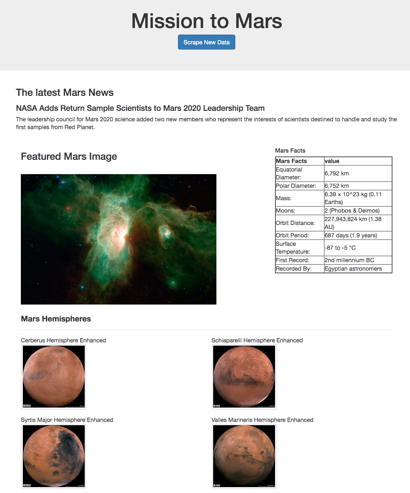

# Web-Scraping-and-Mongo-DB
Challenge is to build a web application that scrapes various websites for data related to the Mission to Mars and displays the information in a single HTML page.

## <ins> Final Look of Website </ins>

### NASA Mars News

* Scrape the [NASA Mars News Site](https://mars.nasa.gov/news/?page=0&per_page=40&order=publish_date+desc%2Ccreated_at+desc&search=&category=19%2C165%2C184%2C204&blank_scope=Latest) and collect the latest News Title and Paragraph Text. Assign the text to variables that you can reference later.

### JPL Mars Space Images - Featured Image

* Visit the url for JPL [Featured Space Image](https://www.jpl.nasa.gov/spaceimages/?search=&category=Mars).Use splinter to navigate the site and find the image url for the current Featured Mars Image and assign the url string to a variable.

### Mars Facts

* Visit the [Mars Facts webpage](https://space-facts.com/mars/) and use Pandas to scrape the table containing facts about the planet including Diameter, Mass, etc. Use Pandas to convert the data to a HTML table string.

### Mars Hemispheres

* Visit the [USGS Astrogeology site](https://astrogeology.usgs.gov/search/results?q=hemisphere+enhanced&k1=target&v1=Mars) to obtain high resolution images for each of Mar's hemispheres.

### MongoDB and Flask Application

Use MongoDB with Flask templating to create a new HTML page that displays all of the information that was scraped from the URLs above.